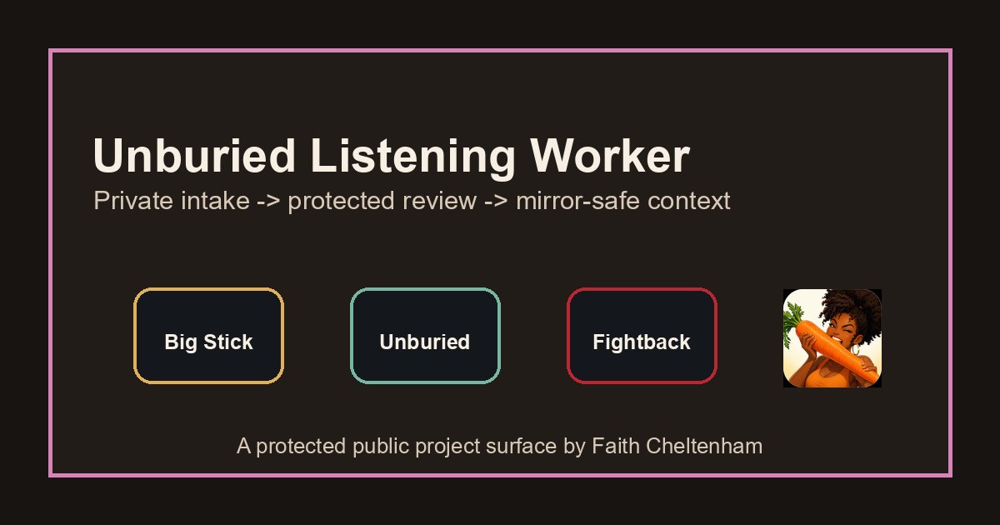
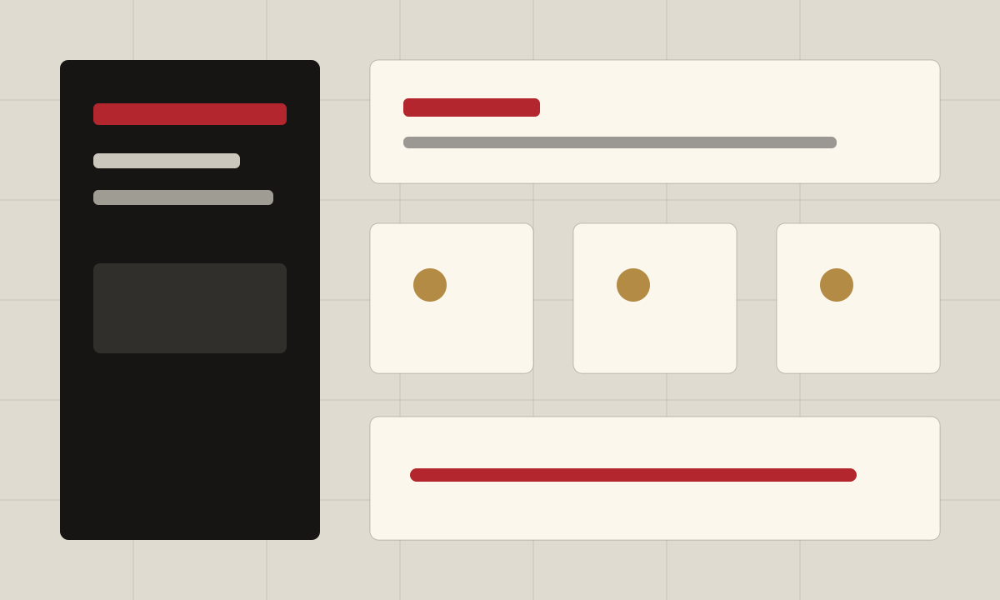
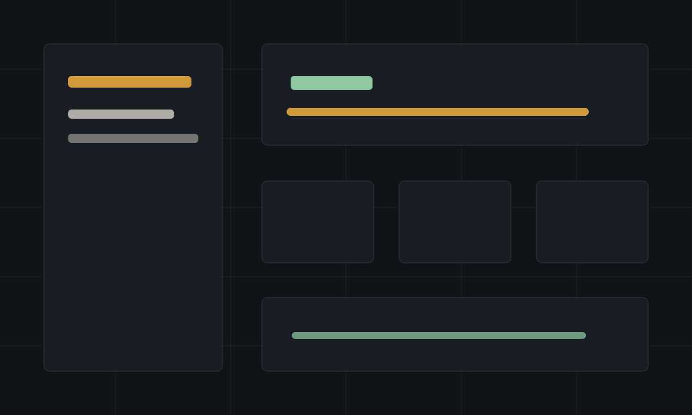
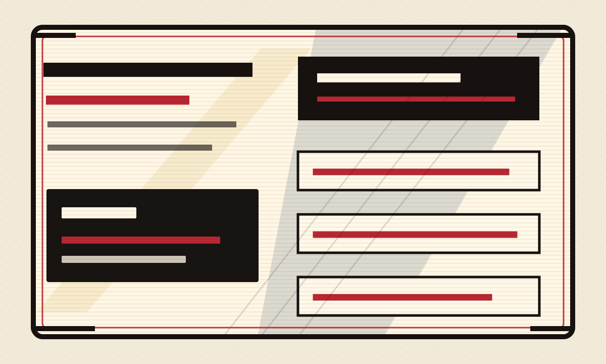
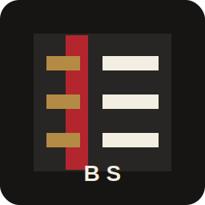

# Unburied Listening Worker

Unburied Listening Worker is a protected companion service for Big Stick and
Unburied listening workflows. It helps intake controlled media, transcripts, and
social review items, then returns mirror-safe review metadata to the private
Big Stick/Unburied system.

This repository is a protected public project surface. It is not the full
source code, operational system, private workflow, or data room.

## Who It Is For

This project surface is for people who need public-safe context about the
existence and seriousness of the Unburied/Big Stick listening architecture:
private reviewers, potential partners, press/background readers, and trusted
technical collaborators.

## Why It Matters

Listening systems can easily collapse sensitive testimony, captions, recordings,
and evidence into unsafe public artifacts. This worker is designed around the
opposite posture: private intake, local processing, protected review, and
public-safe export boundaries.

## How It Works

The public story is simple:

1. Controlled materials enter a private listening lane.
2. Review happens inside protected Big Stick/Unburied workflows.
3. Only approved, mirror-safe metadata or summaries may move outward.

## Existing Ecosystem Visuals

These public-safe brand visuals come from the existing Big Stick / Unburied /
Fightback visual system.

| Big Stick | Unburied | Fightback |
| --- | --- | --- |
|  |  |  |

| Big Stick mark | Unburied mark | Fightback mark |
| --- | --- | --- |
|  |  |  |

## Public Visual Package

The public visual package is intentionally composed from approved existing
Big Stick / Unburied / Fightback assets plus public-safe branded diagrams:

- [Hero image](assets/hero/hero-image.png)
- [GitHub banner](assets/banners/github-banner.png)
- [Social card](assets/social/social-card.png)
- [Project icon](assets/icons/project-icon.png)
- [Workflow overview](assets/diagrams/workflow-overview.svg)
- [Public/private boundary](assets/diagrams/public-private-boundary.svg)

## What Is Public Here

- A high-level project story.
- Public/private boundary documentation.
- A non-sensitive status summary.
- A non-binding roadmap.
- Image and WordPress draft briefs.
- Ownership and commercial-use notices.

## What Remains Private

- Source code and private APIs.
- Runtime credentials, passcodes, tokens, and environment values.
- Raw transcripts, uploads, analysis artifacts, watchlists, and storage data.
- Legal, family, child, medical, benefits, admin, and evidence material.
- Private receipts, deployment scripts, systemd/web-server details, and server
  operations.
- Agent instructions, prompts, workflows, and operational IP.

## Respectful Inquiry

For private discussion, partnership review, press/background context, or future
pilot consideration, contact Faith through her official channels.

No public license, download, product access, or commercial permission is granted
by this project surface.

## Docs

- [Project Brief](docs/PROJECT_BRIEF.md)
- [Status](docs/STATUS.md)
- [Roadmap](docs/ROADMAP.md)
- [Workflow Diagrams](docs/WORKFLOW_DIAGRAMS.md)
- [Image Asset Audit](docs/IMAGE_ASSET_AUDIT.md)
- [Canva Asset Plan](docs/CANVA_ASSET_PLAN.md)
- [Brand Style Notes](docs/BRAND_STYLE_NOTES.md)
- [Public / Private Boundary](docs/PUBLIC_PRIVATE_BOUNDARY.md)
- [Commercial Use Policy](docs/COMMERCIAL_USE_POLICY.md)
- [Privacy Review](docs/PRIVACY_REVIEW.md)
- [WordPress Page Draft](docs/WORDPRESS_PAGE_DRAFT.md)

## Relationship To Faith's Ecosystem

Unburied Listening Worker sits inside Faith Cheltenham's broader Big Stick /
Unburied / Fightback ecosystem as protected listening infrastructure. This repo
is an ownership marker and public-safe explanation, not the private engine.
