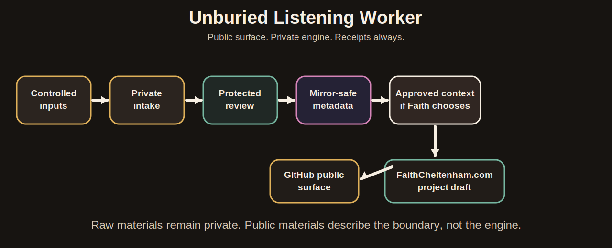
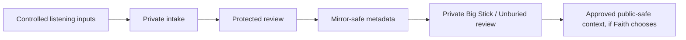
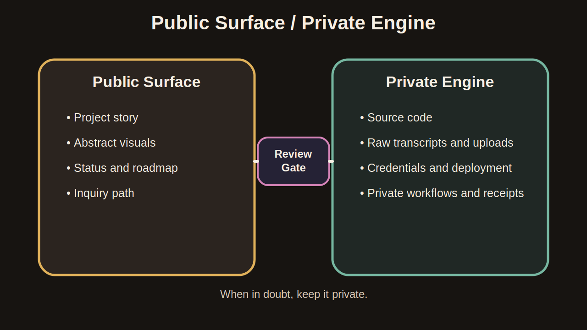
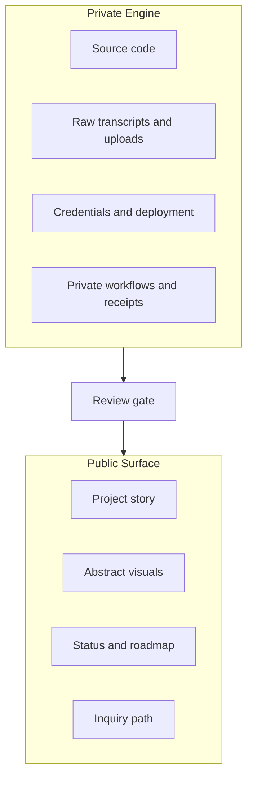

# Workflow Diagrams

These diagrams are public-safe and intentionally abstract. They describe the
boundary without exposing private implementation details.

## Workflow Overview

Source Mermaid:

## Public / Private Boundary

Source Mermaid:

## Safety Notes

- Diagrams do not include endpoint names, tokens, system paths, or server
  topology.
- Diagrams do not describe private legal, family, medical, or admin records.
- Any future diagram that needs more detail should be reviewed before public
  release.
